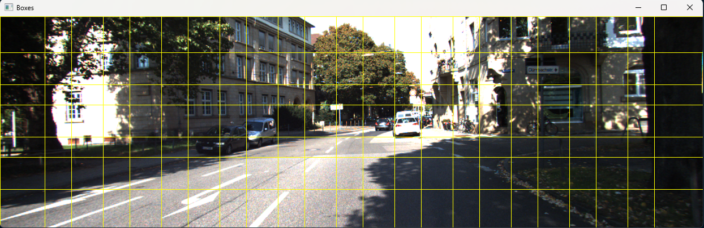
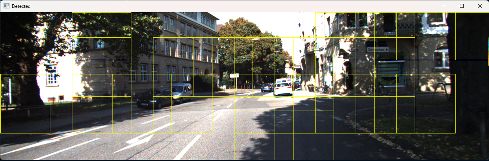
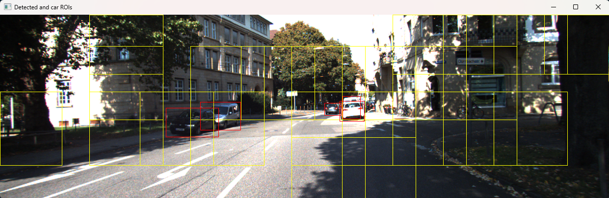

# YODA Car Detection

### YODA (You Only Detect Anchors), a modified version of YOLO, is used in this case to detect cars and place them in bounding boxes within an image.

## Here is an example of the progression:
  

## Here are more prediction results:
|   |  |
| --------------------------------------- | --------------------------------------- |
|   |  |

### [Final Report](ELEC475_Lab4_Report.pdf) 
